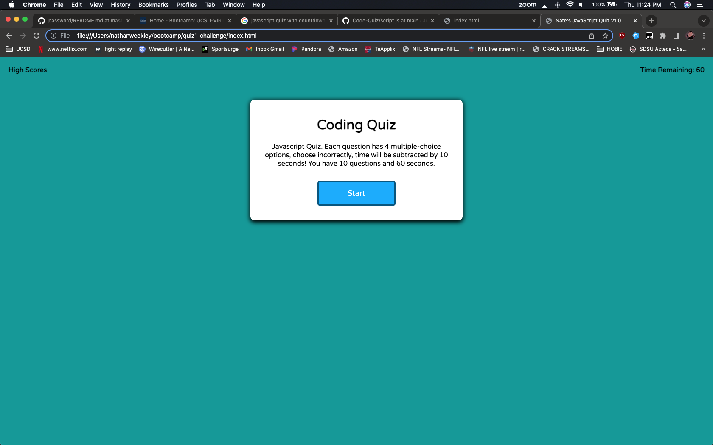
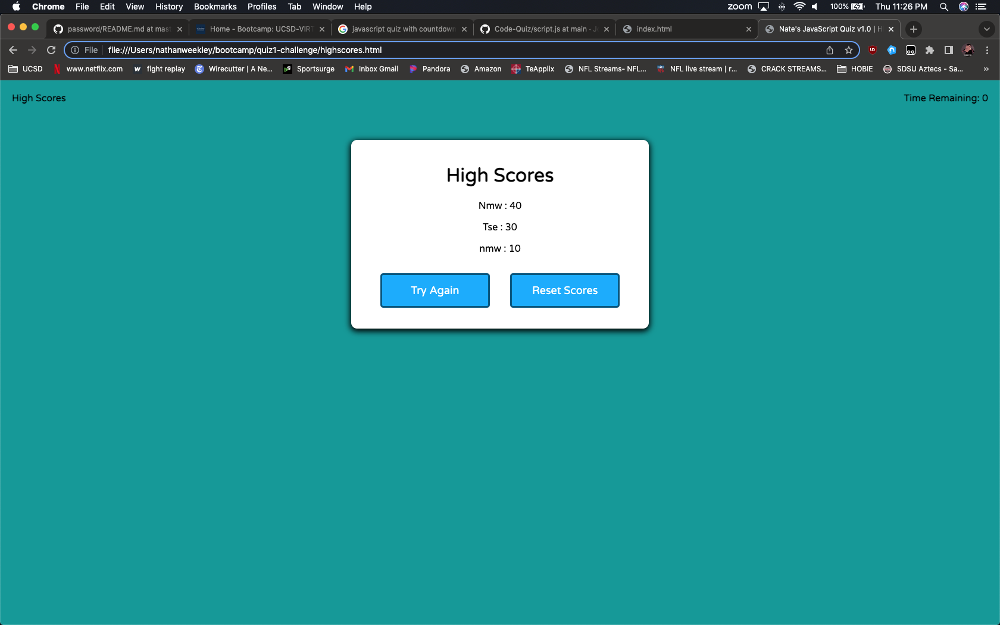

# Nate's Javascript Quiz v1.0
> Create a quiz based on Javascript fundamentals questions.
> Must be multiple choise (4 options A, B, C, D).
> Must begin a countdown timer upon button start.
> Must penalize users for wrong answers by subtracting time from the countdown timer.
> Maintain score based on correct/incorrect answers.
> Store the score locally to be accessed and displayed at end of quiz if requested.
> Save scores for multiple users to gauge progress amoungst peers.
> Live demo [_here_](https://nweekley84.github.io/quiz1-challenge/).

## Table of Contents
* [General Info](#general-information)
* [Technologies Used](#technologies-used)
* [Features](#features)
* [Screenshots](#screenshots)
* [Setup](#setup)
* [Usage](#usage)
* [Project Status](#project-status)
* [Room for Improvement](#room-for-improvement)
* [Acknowledgements](#acknowledgements)
* [Contact](#contact)
* [License](#license)

## General Information
- Create fully functioning quiz from scratch, no starter code provided.
- Purpose is to put into practice local storage and timer intervals.
- Undertaken because it's difficult and uses module 4's examples.

## Technologies Used
- VSCode 1.76.2
- Chrome 112.0.5615.121 
- macOS Mojave 10.14.6 

## Features
- Upon button click, starts 60 second countdown timer and begins quiz.
- Not required, but added feature to randomize questions so they don't always appear in same order (Only created 10 question/answers due to time).
- Keeps track of users score and is stored locally.
- Subtract's 10 seconds off timer if wrong answer selected.
- Not required, but added Green/Red buttons upon 'click' to determine right vs wrong answers in real time.

## Screenshots

## Setup
N/A

## Usage
To test your Javascript knowledge

## Project Status
Project is: / _complete_ /

## Room for Improvement
Room for improvement:
- Figure out why console is throwing error on line 10 of script.js constant shuffleQB()

To do:
- Fix the shuffleQB() error, however the app appears to function fine even with the error.

## Acknowledgements
- This project was inspired by Joel Dore.
- This project was based on [Joel Dore's tutorial examples](https://github.com/JoelDore).
- Many thanks always to MDN Web Docs, Stackoverflow, Google and many many youtube tutorial videos.

## Contact
Created by [nweekley84@gmail.com](mailto:nweekley84@gmail.com) - feel free to contact me!

## License

